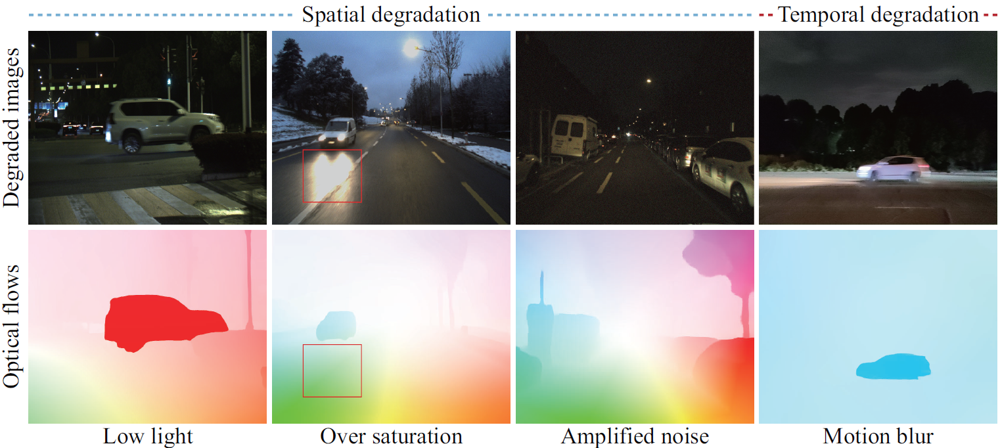
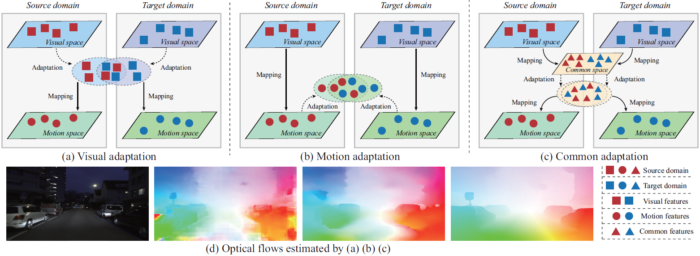
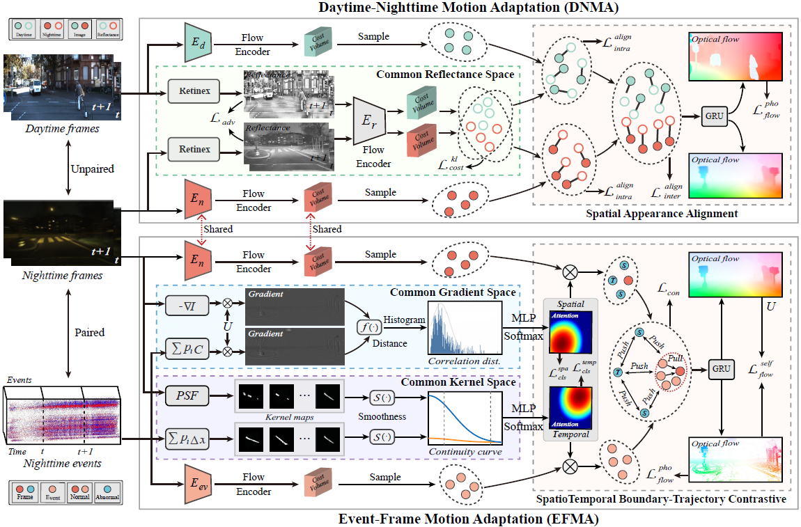
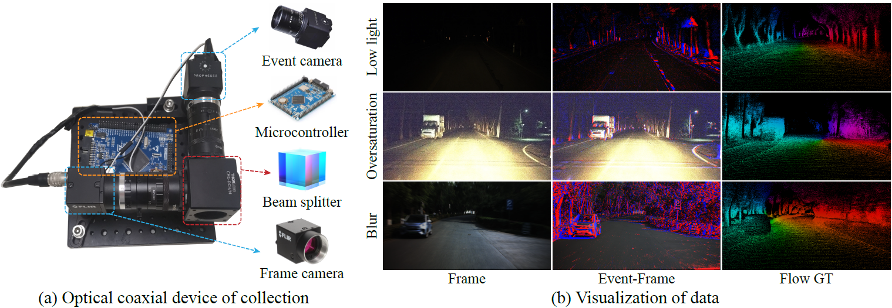

# Nighttime Scene Optical Flow: Common Spatio-Temporal Motion Adaptation

## ICLR 2024, Spotlight

### [ICLR 2024 Version](https://openreview.net/pdf?id=776lhoaulC) | [arXiv](https://arxiv.org/pdf/2401.17642)

[Hanyu Zhou](https://hyzhouboy.github.io/) $^{1}$, [Haonan Wang](https://scholar.google.com/citations?user=DadbHdAAAAAJ&hl=zh-CN) $^{1}$, [Haoyue Liu](https://scholar.google.com/citations?user=DadbHdAAAAAJ&hl=zh-CN) $^{1}$, [Wending Yan](https://scholar.google.com/citations?hl=en&user=VoFRbrQAAAAJ&view_op=list_works&sortby=pubdate) $^{2}$, [Zhiwei Shi](https://scholar.google.com/citations?user=lgiDifUAAAAJ&hl=zh-CN) $^{1}$, [Luxin Yan](https://scholar.google.com/citations?user=5CS6T8AAAAAJ&hl=en) $^{1}$

$^1$ Huazhong University of Science and Technology

$^2$ Huawei International Co. Ltd.



⭐**Our NightFlow framework can make optical flow models perform well on various nighttime degradations.**



⭐Different visual and motion adaptation approaches that are limited by the large domain gap, **our NightFlow method is a common adaptation framework, which has two versions: ABDA-Flow and STDA-Flow**. The **ABDA-Flow** is a initial version accepted by ***ICLR 2024,*** which focuses on low-light and noise degradations in nighttime scenes. The **STDA-Flow** is a extended version on submission, which further enhances the optical flow model on different nighttime degradations, such as low-light, over-saturation, noise and motion blur.

## Framework



This is the extended version STDA-Flow of our common adaptation framework NightFlow, which consists of two components: daytime-nighttime motion adaptation (DNMA) and event-frame motion adpatation (EFMA). The DNMA builds common reflectance space, and *consistently* transfers spatial appearance knowledge of the motion from daytime domain to nighttime domain. The EFMA builds common gradient and kernel spaces, and *contrastively* transfers spatial boundary knowledge and temporal trajectory knowledge of the motion from event domain to nighttime frame domain. 

## News

2026.1.5: Testing code and pre-trained weights of the initial version ABDA-Flow model are released.

2025.7.20: Our STDA-Flow extended version of the NightFlow work is finished.

2024.1.16: Our ABDA-Flow version of the NightFlow work is accepted by ICLR 2024.

## Environmental Setups

```
git clone https://github.com/hyzhouboy/NightFlow.git
cd NightFlow
conda create -n NightFlow python=3.8
conda activate NightFlow

conda install pytorch=1.6.0 torchvision=0.7.0 cudatoolkit=10.1 matplotlib tensorboard scipy opencv -c pytorch
pip install yacs loguru einops timm==0.4.12 imageio
```

## Preparing Dataset

The training datasets of the initial version ABDA-Flow contain daytime and nighttime components of [KITTI](https://www.cvlibs.net/datasets/kitti/) datasets and [DSEC](https://dsec.ifi.uzh.ch/) datasets. As for the extended version STDA-Flow, we build an optical coaxial device to self-collect pixel-aligned frame images and event streams, and construct a nighttime frame-event datasets with optical flow GTs. In the future, we will release the full training datasets.



## Testing

We provide the pre-trained weights of the initial version [ABDA-Flow model](https://drive.google.com/file/d/1hbtiwr5oRY5HOZh4cQPLEkklgIpxqWZr/view?usp=sharing). You can perform the inference code (please refer to *demo.py*):

```
python -u demo.py --model model/ABDA_dsec.pth --img_path /path/your_nighttime_images --mixed_precision
```

## (Optional) Efficient Implementation

You can optionally use our alternate (efficent) implementation by compiling the provided cuda extension:

```
cd alt_cuda_corr
python setup.py install
cd ..
```

and running *demo.py* with the `--alternate_corr` flag Note, which improves the inference efficiency.

## TO DO

```
[x] Releasing Testing code and pre-trained models.
[ ] Releasing parts of training datasets.
[ ] Releasing the pre-trained models of extended version for various nighttime degradation conditions.
[ ] Releasing full training datasets and training codes upon acceptance of the extended version.
```

## Citation

If you find this repository/work helpful in your research, welcome to cite this paper and give a ⭐.

```
@article{zhou2024exploring,
  title={Exploring the common appearance-boundary adaptation for nighttime optical flow},
  author={Zhou, Hanyu and Chang, Yi and Liu, Haoyue and Yan, Wending and Duan, Yuxing and Shi, Zhiwei and Yan, Luxin},
  journal={arXiv preprint arXiv:2401.17642},
  year={2024}
}

@inproceedings{zhouexploring,
  title={Exploring the Common Appearance-Boundary Adaptation for Nighttime Optical Flow},
  author={Zhou, Hanyu and Chang, Yi and Liu, Haoyue and WENDING, YAN and Duan, Yuxing and Shi, Zhiwei and Yan, Luxin},
  booktitle={The Twelfth International Conference on Learning Representations}
}
```
